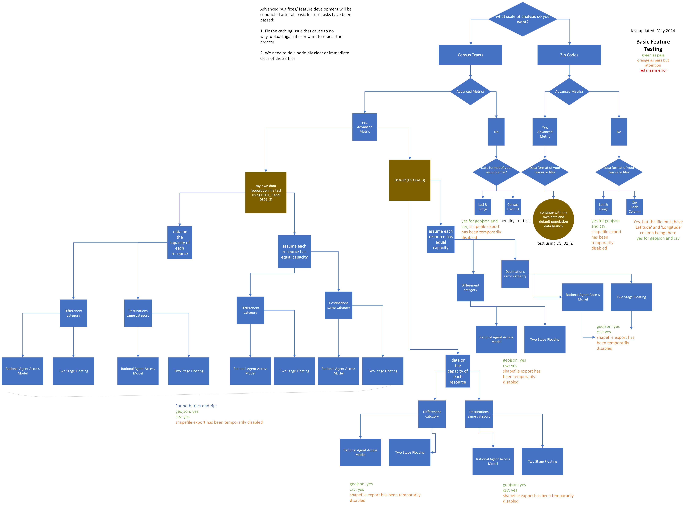
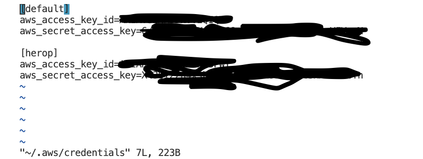
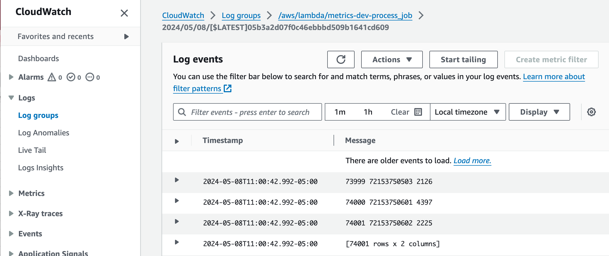
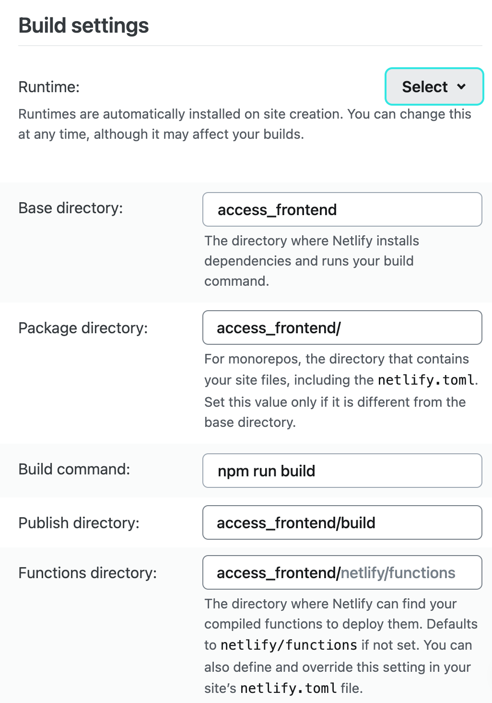

# The Access App
[](https://app.netlify.com/sites/helpful-lollipop-5db1fd/deploys)

- [Roadmap](#roadmap)
- [A Step-by-Step Setup Guide using Serverless, AWS, and Netlify](#a-step-by-step-setup-guide-using-serverless-aws-and-netlify)

## Roadmap




## A Step-by-Step Setup Guide using Serverless, AWS, and Netlify

*Lastly updated on May 2024*

Follow this step by step to set up the Access App on your local machine, with Netlify deployment

1. Clone the fix_app branch of the repository to your machine

2. If you don't have serverless installed, install it by running the following command in your terminal

```bash
npm install -g serverless
```

3. Create an AWS account and set up an IAM user with the following policies. This is the minimum required for the IAM user to create AWS access keys and secret keys, as well as give serverless access to deploy the lambda functions and S3 buckets:

```bash
{
	"Version": "2012-10-17",
	"Statement": [
		{
			"Sid": "AllowViewAccountInfo",
			"Effect": "Allow",
			"Action": [
				"iam:GetAccountPasswordPolicy",
				"iam:GetAccountSummary",
				"iam:CreateRole",
				"iam:GetRole",
				"iam:TagUser",
				"iam:TagRole",
				"iam:PutRolePolicy",
				"iam:DeleteRolePolicy"
			],
			"Resource": "*"
		},
		{
			"Sid": "AllowManageOwnPasswords",
			"Effect": "Allow",
			"Action": [
				"iam:ChangePassword",
				"iam:GetUser"
			],
			"Resource": "arn:aws:iam::*:user/${aws:username}"
		},
		{
			"Sid": "ManageOwnAccessKeys",
			"Effect": "Allow",
			"Action": [
				"iam:CreateAccessKey",
				"iam:DeleteAccessKey",
				"iam:GetAccessKeyLastUsed",
				"iam:ListAccessKeys",
				"iam:UpdateAccessKey"
			],
			"Resource": [
				"arn:aws:iam::*:user/${aws:username}"
			]
		},
		{
			"Sid": "AccessAppControl",
			"Effect": "Allow",
			"Action": [
				"cloudformation:*",
				"cloudwatch:*",
				"apigateway:*",
				"s3:*",
				"lambda:*"
			],
			"Resource": "*"
		},
		{
			"Sid": "CloudFormationLogs",
			"Effect": "Allow",
			"Action": [
				"logs:*"
			],
			"Resource": "*"
		},
		{
			"Sid": "PassRoleWithResource",
			"Effect": "Allow",
			"Action": [
				"iam:PassRole"
			],
			"Resource": "arn:aws:iam::*:role/metrics-dev*"
		}
	]
}
```

4. Set up the AWS CLI on your machine and configure it with the IAM user's access keys and secret keys. Based on the policy above, users should be able to create access keys and secret keys for themselves. You should be use `Security credentials` in AWS menu to set up the AWS CLI on your machine:


After you get access key and secret key, you can configure the AWS CLI on your machine:

```bash
aws configure
```

If you have multiple profiles, you can specify the profile name when configuring the AWS CLI:

```bash
sudo vim ~/.aws/credentials
```


5. Set up an S3 bucket for the processing steps. In your S3 account, create a bucket and a folder called `jobs` within the bucket to store the data for the calculations. 


Note that S3 bucket name needs to be unique across all AWS accounts. So you may need to try different names if the bucket name is already taken.

6. Edit the CORS setting in S3 buckets for your local and remote access. In the bucket, go to the `Permissions` tab and click on `CORS configuration`. Add the following CORS configuration:

```xml
[
    {
        "AllowedHeaders": [
            "*"
        ],
        "AllowedMethods": [
            "GET",
            "PUT",
            "POST",
            "DELETE"
        ],
        "AllowedOrigins": [
            "https://your_deoloyment_url",
            "http://localhost:3000"
        ],
        "ExposeHeaders": []
    }
]
```
Change the localhost port number and the deployment URL to your own.

7. Edit the `serverless.yml` file in `lambda_functions` folder to point to the correct bucket and path:

```yaml
environment:
  # Bucket that is used to store the data for the calculations
  ACCESS_BUCKET: "your bucket name created in step 5"
  # Path within the bucket to be used to store the data
  ACCESS_PATH: "jobs"
  REGION_NAME: "your bucket region"
...
process_job:
    handler: geo_handler.process_job # trigger when there's creation in the S3 bucket
    timeout: 300
    memorySize: 10240
    events:
      - s3:
          bucket: your_bucket_name_created_in_step_5"
```
other settings could stay as default.

8. Install the `serverless-python-requirements` plugin at the root of the project:

```bash
npm install serverless-python-requirements
```

9. In the `lambda_functions` folder, run the following command to deploy the application (note that the first time you run this command, it may take a while to install the dependencies):

```bash
sls deploy
```

If everything goes smoothly, you will get an endpoint for the generated API. Note this down to be able to connect the frontend:


10.In the `src/Hooks/useJobRunner.js` file, change the `BASE_URL` constant to be the one reported by serverless when you deployed:

```javascript
const BASE_URL = "URL reported by serverless in the last step"
```

11. To run the frontend application locally, you will need to have [nodejs](https://nodejs.org/en/download/) installed and [yarn](https://classic.yarnpkg.com/lang/en/docs/install/). Then follow these steps to get up and running:

```bash
cd access_frontend
npm i
npm start
```

12. This should open the application at http://localhost:3000. You can now use the Access App to process the data. You can check the data processing status in the S3 bucket you created in step 5, and possibly modify the codes in lambda_functions folder to see backend output to CloudWatch:



13. To deploy the frontend application, you can use Netlify. Create an account on Netlify and link your GitHub repository to Netlify. We have ready prepare the `netlify.toml` file in the root of the `access_frontend` folder.

14. In the deployment configuration, set the Base directory to be `access_frontend` and set the build command to `npm run build` and the publish directory to `build`:

  

## Possible Problems & Solutions

- `Deployment bucket has been removed manually. Please recreate it or remove your service and attempt to deploy it again`: first of all, make sure your are using the correct aws profile, then remove the s3 bucket and try to deploy again.

- `CustomS3Bucket: AccessDenied: Access Denied`: make sure you have the correct permissions in the IAM user, and check to make sure you apply correct AWS profile & credentials.

- In the Netlify deployment, you may see the build fail with following message:

  

  To solve this, check all the warnings listed below this message and fix them. This error is because CI is enabled by default and CI treat warnings as errors. (You can disable CI in the Netlify deployment settings by setting `CI=false` in the environment variables, but this is not recommended.)